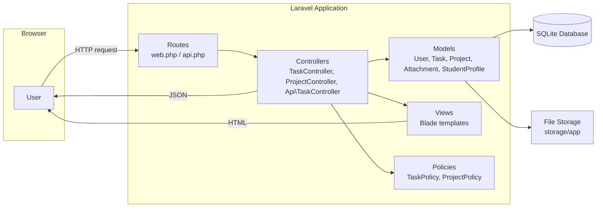
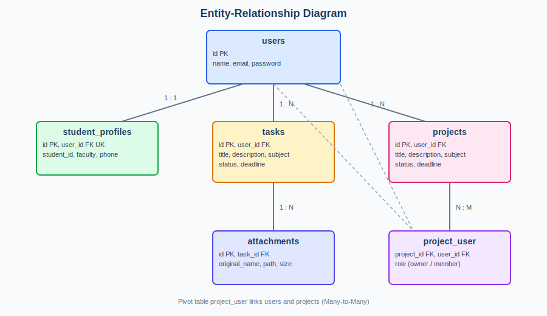
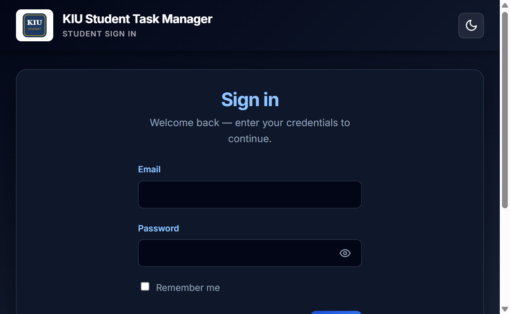
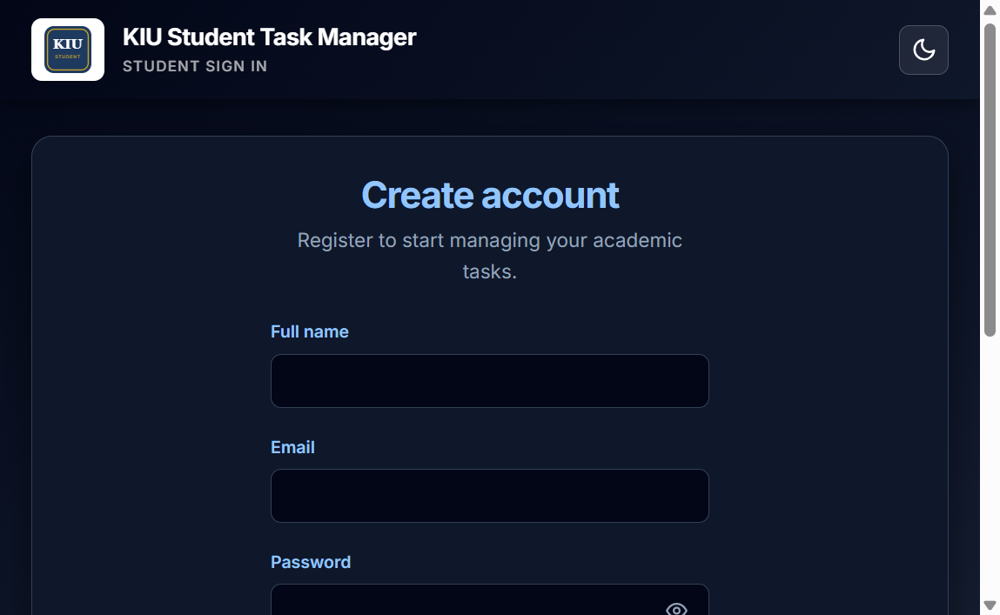
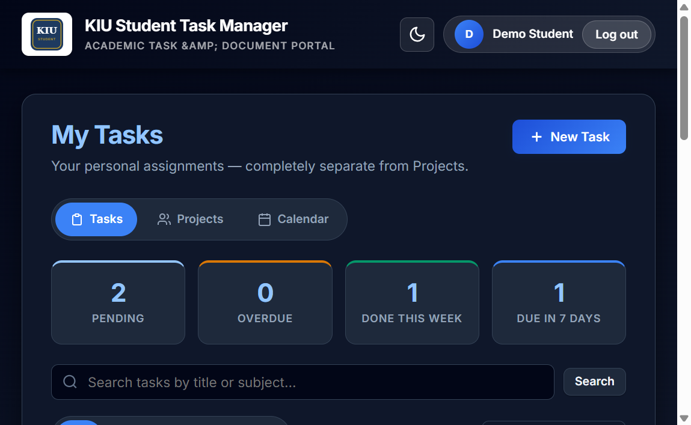
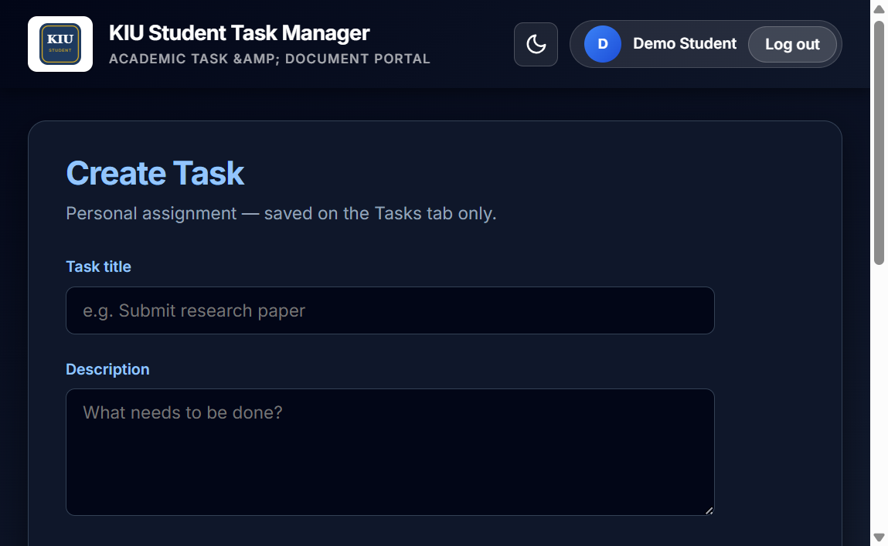
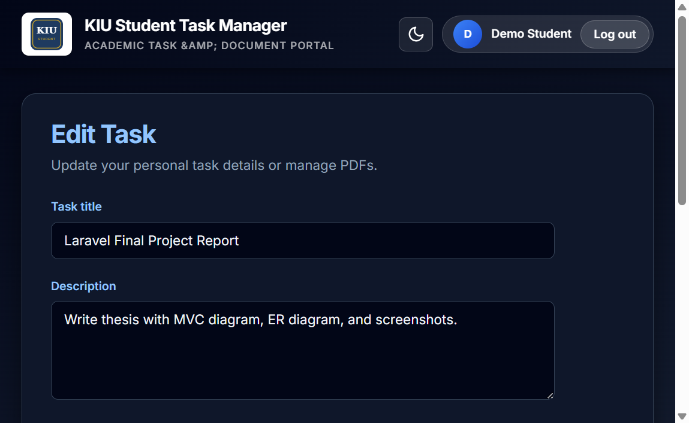
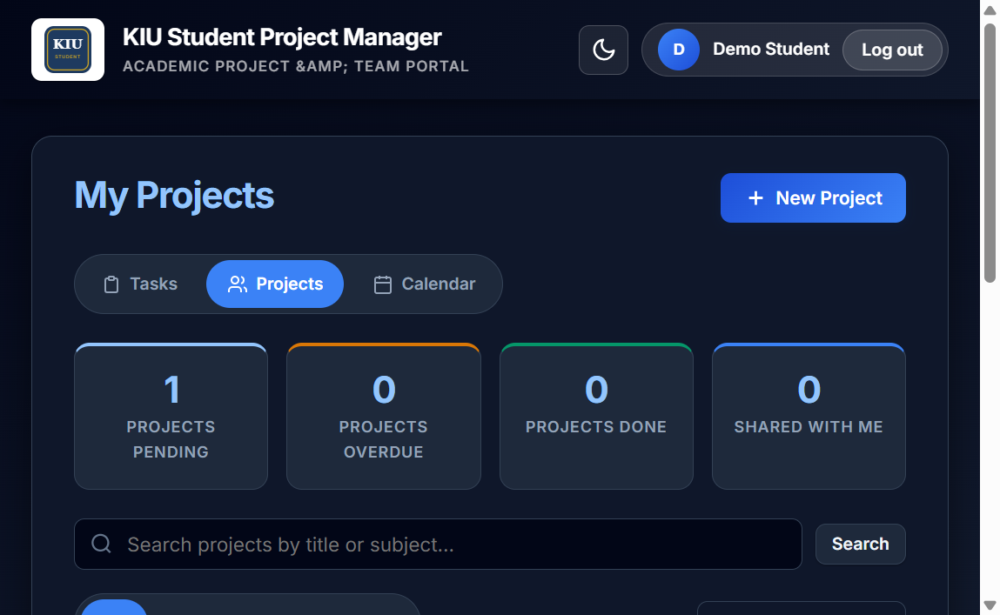
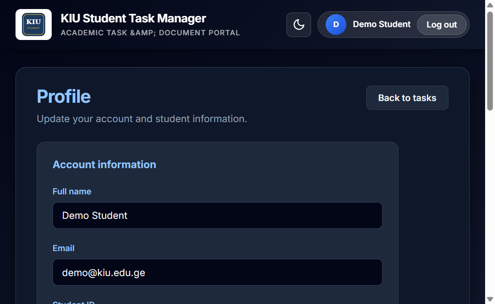

# KIU Student Task Manager — Final Project Report

**Author:** [Saba saralidze ]  
**Course:** Web Programming  
**University:** Kutaisi International University (KIU)  
**Date:** June 2026  

---

## Abstract

This report describes the design and implementation of **KIU Student Task Manager**, a Laravel-based web application that helps KIU students manage personal academic tasks (with PDF attachments) and team projects. The system demonstrates MVC architecture, database migrations, Eloquent ORM relationships, full CRUD operations, Blade templating, authentication with middleware, form validation, CSRF protection, file uploads, and a basic JSON API.

---

## 1. Introduction

### 1.1 Problem and motivation

Students at Kutaisi International University need a simple way to track assignment deadlines, store related documents, and collaborate on group projects. Paper notes and generic to-do apps do not reflect the academic context or support team membership.

### 1.2 Project goal

Build a **fully functional CRUD web application** using **PHP and Laravel** that:

- Lets authenticated users manage **tasks** and **projects**
- Supports **PDF file uploads** on tasks
- Allows project owners to add **teammates** by email
- Exposes a small **JSON API** for reading tasks
- Uses **KIU branding** as recommended by the course syllabus

### 1.3 Technologies

| Technology | Role |
|------------|------|
| PHP 8.2+ | Server-side language |
| Laravel 12 | MVC framework |
| SQLite | Database (configurable to MySQL) |
| Blade | Server-side templating |
| Eloquent ORM | Database abstraction and relationships |

---

## 2. System architecture (MVC)

Laravel follows the **Model–View–Controller** pattern. Each HTTP request is routed to a controller, which uses models to read/write the database and returns a Blade view (HTML) or JSON response.

### 2.1 MVC diagram


*Figure 2.1: Model–View–Controller flow. HTTP requests enter through routes and controllers; models interact with the database and storage; responses return as Blade HTML or JSON.*



### 2.2 Layer responsibilities

| Layer | Location | Responsibility |
|-------|----------|----------------|
| **Model** | `app/Models/` | Database tables, Eloquent relationships, business data |
| **View** | `resources/views/` | HTML via Blade (`@extends`, `@section`, `@include`, `@if`, `@foreach`) |
| **Controller** | `app/Http/Controllers/` | Handle requests, validation, authorization, return view or JSON |
| **Routes** | `routes/web.php`, `routes/api.php` | Map URLs to controller actions |
| **Middleware** | `auth`, `guest` | Protect routes (logged-in users only vs guests only) |
| **Policies** | `app/Policies/` | Check if a user may view/update/delete a resource |

### 2.3 Example request flow (create task)

1. User submits form at `POST /tasks` with `@csrf` token.
2. `TaskController@store` validates input.
3. `$request->user()->tasks()->create([...])` saves via Eloquent.
4. Optional PDFs stored via `Attachment::storePdf()`.
5. Redirect to `/tasks` (Read list).

---

## 3. Database design

### 3.1 Entity–Relationship diagram



*Figure 3.1: Database tables and relationships (one-to-one, one-to-many, many-to-many).*

```mermaid
erDiagram
    users ||--o| student_profiles : "has one"
    users ||--o{ tasks : "owns"
    users ||--o{ projects : "owns"
    users }o--o{ projects : "project_user"
    tasks ||--o{ attachments : "has many"
    project_user {
        bigint project_id FK
        bigint user_id FK
        string role
    }
    users {
        bigint id PK
        string name
        string email
        string password
    }
    student_profiles {
        bigint id PK
        bigint user_id FK UK
        string student_id
        string faculty
        string phone
    }
    tasks {
        bigint id PK
        bigint user_id FK
        string title
        text description
        string subject
        enum status
        date deadline
    }
    projects {
        bigint id PK
        bigint user_id FK
        string title
        text description
        string subject
        enum status
        date deadline
    }
    attachments {
        bigint id PK
        bigint task_id FK
        string original_name
        string path
        int size
    }
```

### 3.2 Relationships summary

| Type | Relationship | Implementation |
|------|--------------|----------------|
| **One-to-One** | User ↔ StudentProfile | `user_id` unique on `student_profiles` |
| **One-to-Many** | User → Task | `tasks.user_id` |
| **One-to-Many** | User → Project | `projects.user_id` |
| **One-to-Many** | Task → Attachment | `attachments.task_id` |
| **Many-to-Many** | Project ↔ User | Pivot `project_user` with `role` (owner/member) |

### 3.3 Migrations

Schema is version-controlled in `database/migrations/`. Main commands:

```bash
php artisan migrate        # apply migrations
php artisan migrate:fresh --seed   # reset + demo data
```

---

## 4. Functional modules

### 4.1 Authentication

- **Register** (`/register`), **Login** (`/login`), **Logout**
- **Password reset** (forgot password flow)
- **Middleware:** `guest` on auth pages, `auth` on application routes



*Figure 4.1: Login page with CSRF-protected form and guest middleware.*



*Figure 4.2: User registration (authentication).*

### 4.2 Tasks (CRUD)

| Operation | Route | Method |
|-----------|-------|--------|
| List | `/tasks` | GET |
| Create form | `/tasks/create` | GET |
| Store | `/tasks` | POST |
| Edit form | `/tasks/{task}/edit` | GET |
| Update | `/tasks/{task}` | PUT/PATCH |
| Delete | `/tasks/{task}` | DELETE |

- **Authorization:** `TaskPolicy` — only the task owner can edit/delete.
- **Validation:** title, description, subject, deadline required; PDF optional (max 10 files, 10 MB each).



*Figure 4.3: Task index with dashboard statistics, search, and filters.*



*Figure 4.4: Create task form with validation and PDF upload field.*



*Figure 4.5: Edit task form — update operation and file upload.*

### 4.3 Projects (CRUD + teammates)

Same CRUD pattern via `Route::resource('projects', ...)`.

- **Many-to-Many:** teammates linked in `project_user` pivot.
- Owner can add/remove members by email.



*Figure 4.6: Projects list showing Many-to-Many team members (owner and member roles).*

### 4.4 Profile (One-to-One)

- `StudentProfile` stores student ID, faculty, phone.
- Auto-created when user registers.



*Figure 4.7: User profile linked to StudentProfile (One-to-One Eloquent relationship).*

### 4.5 File uploads

- PDFs uploaded on task create/edit.
- Stored in `storage/app/task-attachments/{task_id}/`.
- `Attachment` model records path and original filename.
- Download via `GET /attachments/{attachment}/download`.
- Files deleted from disk when attachment record is removed.

### 4.6 Blade templating

Reusable layout `layouts/app.blade.php` with partials:

- `@include('layouts.partials.app-nav')`
- `@include('layouts.partials.kiu-styles')`
- `@foreach ($tasks as $task)` on index pages
- `@if ($errors->any())` for validation messages

### 4.7 JSON API (API basics)

Authenticated endpoints (session auth):

| Method | URL | Response |
|--------|-----|----------|
| GET | `/api/tasks` | JSON list of current user's tasks |
| GET | `/api/tasks/{id}` | JSON single task with attachments |

Implemented with `App\Http\Controllers\Api\TaskController` and `TaskResource` for consistent JSON structure.

**Example response** (`GET /api/tasks`):

```json
{
  "data": [
    {
      "id": 1,
      "title": "Database Systems Assignment",
      "description": "Complete ER diagram exercises.",
      "subject": "Database Systems",
      "status": "pending",
      "deadline": "2026-06-24",
      "attachments": []
    }
  ]
}
```

**Testing API:** Log in via browser, then visit `/api/tasks` in the same session, or use `php artisan test --filter=TaskApiTest`.

---

## 5. Security

| Mechanism | Usage |
|-----------|--------|
| **CSRF** | `@csrf` on all POST/PATCH/DELETE forms |
| **Validation** | Server-side rules in controllers and `ProfileUpdateRequest` |
| **Middleware** | `auth` prevents guest access to tasks/projects |
| **Policies** | Prevent users from editing others' tasks |
| **Password hashing** | Laravel `Hash` / `casts` on User model |

---

## 6. Installation and usage

```bash
composer install
copy .env.example .env          # Windows
php artisan key:generate
php artisan migrate
php artisan db:seed
php artisan serve
```

Open `http://localhost:8000`. Demo login: `demo@kiu.edu.ge` / `password`.

Run tests: `php artisan test`

---

## 7. Application screenshots (summary)

All UI figures are embedded in Section 4 above. For the printed KIU thesis (Word), insert the same image files from `docs/screenshots/`:

| Figure | File | Section |
|--------|------|---------|
| 4.1 | `01-login.png` | Authentication |
| 4.2 | `07-register.png` | Authentication |
| 4.3 | `02-tasks-index.png` | Tasks CRUD |
| 4.4 | `03-task-create.png` | Tasks CRUD |
| 4.5 | `04-task-edit-pdf.png` | Tasks + file upload |
| 4.6 | `05-projects-index.png` | Projects + Many-to-Many |
| 4.7 | `06-profile-student.png` | One-to-One profile |

Diagram files for Word: `docs/diagrams/mvc-diagram.svg`, `docs/diagrams/er-diagram.svg`

---

## 8. Conclusion

The **KIU Student Task Manager** successfully demonstrates all required Laravel concepts: MVC separation, migrations, Eloquent relationships (one-to-one, one-to-many, many-to-many), CRUD with CSRF, Blade layouts and directives, validation and authentication with middleware, file uploads, resource controllers, and basic JSON API responses. The application theme aligns with KIU as recommended by the syllabus.

### 8.1 Possible future improvements

- Email notifications before deadlines
- REST API for projects using Laravel Sanctum tokens
- Pagination on large task lists

---

## References

- Laravel Documentation: https://laravel.com/docs  
- KIU Academic Calendar 2025–2026  
- Course materials: Web Programming, Kutaisi International University  

---

**Diagram and screenshot files**

- MVC diagram: `docs/diagrams/mvc-diagram.svg`
- ER diagram: `docs/diagrams/er-diagram.svg`
- UI screenshots: `docs/screenshots/*.png`

To build the official Word thesis: copy this report into the KIU template; images are already linked above and will paste into Word when you copy from a Markdown viewer, or insert the PNG/SVG files manually from the folders listed.
